# End-to-End Telecom Network Operations Architecture

```mermaid
flowchart TB
    %% Styling
    classDef sourceStyle fill:#29B5E8,stroke:#1E88E5,color:#fff,font-weight:bold
    classDef snowflakeStyle fill:#F5F5F5,stroke:#29B5E8,stroke-width:3px
    classDef dbStyle fill:#C8E6C9,stroke:#4CAF50,color:#2E7D32
    classDef schemaStyle fill:#E8F5E9,stroke:#4CAF50,font-size:10px
    classDef siStyle fill:#BBDEFB,stroke:#1E88E5
    classDef agentStyle fill:#90CAF9,stroke:#1565C0,font-weight:bold
    classDef featureStyle fill:#FFE0B2,stroke:#FF9800
    classDef dashStyle fill:#F8BBD9,stroke:#E91E63

    %% Data Sources
    subgraph sources["📡 DATA SOURCES"]
        direction LR
        ran4g["4G RAN<br/>eNodeB<br/>150 sites"]
        ran5g["5G RAN<br/>gNodeB<br/>300 sites"]
        core4g["4G Core<br/>MME / SGW / PGW"]
        core5g["5G Core<br/>AMF / SMF / UPF"]
        transport["Transport<br/>Routers / Switches"]
        cells["Cell Sites<br/>450 across Portugal"]
    end

    %% Snowflake Platform
    subgraph snowflake["❄️ SNOWFLAKE AI DATA CLOUD"]
        
        %% Database
        subgraph db["🗄️ NETWORK_OPERATIONS_DB"]
            direction LR
            subgraph schemas["Schemas"]
                direction LR
                s1["RAN_4G"]
                s2["RAN_5G"]
                s3["CORE_4G"]
                s4["CORE_5G"]
                s5["TRANSPORT"]
            end
            analytics["📊 ANALYTICS<br/>Fact Tables, Dimensions, Views"]
        end

        %% Snowflake Intelligence
        subgraph si["🤖 SNOWFLAKE INTELLIGENCE"]
            direction LR
            sv["Semantic View<br/>NETWORK_SEMANTIC_VIEW<br/>32 Dimensions | 17 Metrics"]
            agent["Cortex Agent<br/>NETWORK_OPERATIONS_AGENT<br/>Natural Language → SQL → Insights"]
            analyst["Cortex<br/>Analyst"]
        end

        %% Features
        subgraph features["⚡ CAPABILITIES"]
            direction LR
            f1["Real-Time KPIs<br/>RRC, Throughput, PRB"]
            f2["3D Visualization<br/>PyDeck Maps"]
            f3["Fault Correlation<br/>Root Cause Analysis"]
            f4["ML Analytics<br/>Anomaly Detection"]
            f5["SLA Monitoring<br/>MTTD/MTTR"]
            f6["NL Queries<br/>Ask in English"]
        end
    end

    %% Streamlit Dashboards
    subgraph dashboards["📱 STREAMLIT DASHBOARDS"]
        direction LR
        d1["👨‍🔧 Network Engineer<br/>• Real-time monitoring<br/>• 3D network maps<br/>• Fault simulation"]
        d2["📈 Performance Analyst<br/>• Trend analysis<br/>• Capacity planning<br/>• QoE metrics"]
        d3["👔 Network Manager<br/>• SLA monitoring<br/>• MTTD/MTTR tracking<br/>• Team performance"]
        d4["💼 Executive<br/>• Revenue/churn<br/>• YoY/QoQ growth<br/>• Competitive analysis"]
    end

    %% Connections
    ran4g & ran5g & core4g & core5g & transport & cells --> db
    schemas --> analytics
    analytics --> sv
    sv --> agent
    agent --> analyst
    db --> features
    features --> dashboards

    %% Apply styles
    class ran4g,ran5g,core4g,core5g,transport,cells sourceStyle
    class db dbStyle
    class s1,s2,s3,s4,s5,analytics schemaStyle
    class sv siStyle
    class agent agentStyle
    class f1,f2,f3,f4,f5,f6 featureStyle
    class d1,d2,d3,d4 dashStyle
```

## Data Flow Summary

| Layer | Components | Description |
|-------|------------|-------------|
| **Data Sources** | 4G/5G RAN, Core, Transport | Raw network performance metrics |
| **Data Platform** | Snowflake schemas | Unified data model with 750K+ records |
| **Intelligence** | Semantic View + Cortex Agent | Natural language query interface |
| **Presentation** | 4 Streamlit dashboards | Role-based analytics views |

## Key Metrics

- **450** Cell Sites across 15 Portuguese cities
- **750K+** Performance records
- **32** Semantic dimensions
- **17** Pre-defined metrics
- **4** Persona dashboards
